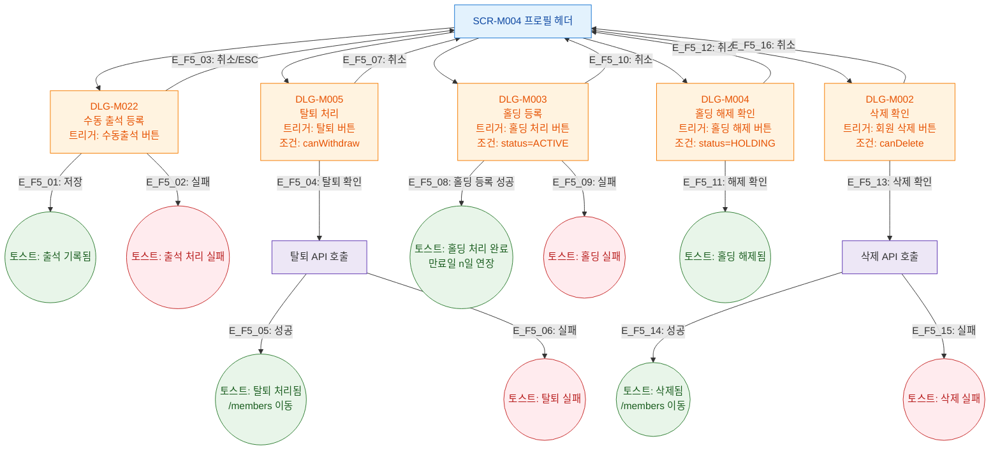

## 1. 목적

SCR-M004 루트(프로필 헤더/하단 상태관리/위험구역)에서 트리거되는 모달 전체를 트리 구조로 정의한다. 탭별 모달은 각 탭의 F5에서 정의한다.

## 2. 전제조건

- SCR-M004 데이터 로드 완료

## 3. 다이어그램

## 4. 엣지 설명

| 엣지 ID | 모달 | 결과 |
|---------|------|------|
| E_F5_01 | DLG-M022 | 수동출석 저장 성공 → 토스트 |
| E_F5_02 | DLG-M022 | 수동출석 실패 → 에러 토스트 |
| E_F5_03 | DLG-M022 | 취소/ESC → 모달 닫기 |
| E_F5_04 | DLG-M005 | 탈퇴 확인 → API |
| E_F5_05 | DLG-M005 | 탈퇴 성공 → 토스트 + 이동 |
| E_F5_06 | DLG-M005 | 탈퇴 실패 → 에러 토스트 |
| E_F5_07 | DLG-M005 | 취소 → 모달 닫기 |
| E_F5_08 | DLG-M003 | 홀딩 등록 성공 → 토스트 |
| E_F5_09 | DLG-M003 | 홀딩 실패 → 에러 토스트 |
| E_F5_10 | DLG-M003 | 취소 → 모달 닫기 |
| E_F5_11 | DLG-M004 | 홀딩 해제 확인 → 토스트 |
| E_F5_12 | DLG-M004 | 취소 → 모달 닫기 |
| E_F5_13 | DLG-M002 | 삭제 확인 → API |
| E_F5_14 | DLG-M002 | 삭제 성공 → 토스트 + 이동 |
| E_F5_15 | DLG-M002 | 삭제 실패 → 에러 토스트 |
| E_F5_16 | DLG-M002 | 취소 → 모달 닫기 |

## 5. TC 후보

| TC ID | 타입 | Given | When | Then |
|-------|:----:|-------|------|------|
| TC-M004-F5-01 | positive P0 | ACTIVE 회원 | 수동출석 버튼 클릭 후 저장 | 출석 기록, 토스트 표시 |
| TC-M004-F5-02 | positive P0 | ACTIVE 회원, manager | 홀딩 처리 → 등록 확인 | 홀딩 처리 완료 토스트, 만료일 연장 |
| TC-M004-F5-03 | positive P0 | HOLDING 회원 | 홀딩 해제 → 확인 | 홀딩 해제 토스트 |
| TC-M004-F5-04 | positive P1 | manager, canWithdraw | 탈퇴 → 확인 | 탈퇴 토스트, /members 이동 |
| TC-M004-F5-05 | positive P1 | primary, canDelete | 삭제 → 확인 | 삭제 토스트, /members 이동 |
