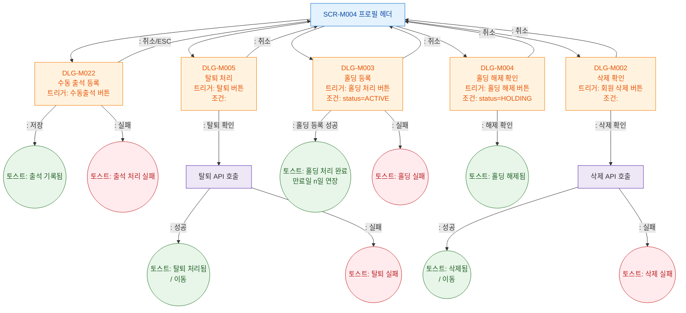

## 1. 목적

SCR-M004 루트(프로필 헤더/하단 상태관리/위험구역)에서 트리거되는 모달 전체를 트리 구조로 정의한다. 탭별 모달은 각 탭의 F5에서 정의한다.

## 2. 전제조건

- SCR-M004 데이터 로드 완료

## 3. 다이어그램

## 4. 엣지 설명

| 모달 | 결과 | |---------|------|------| | | DLG-M022 | 수동출석 저장 성공 → 토스트 | | | DLG-M022 | 수동출석 실패 → 에러 토스트 | | | DLG-M022 | 취소/ESC → 모달 닫기 | | | DLG-M005 | 탈퇴 확인 → API | | | DLG-M005 | 탈퇴 성공 → 토스트 + 이동 | | | DLG-M005 | 탈퇴 실패 → 에러 토스트 | | | DLG-M005 | 취소 → 모달 닫기 | | | DLG-M003 | 홀딩 등록 성공 → 토스트 | | | DLG-M003 | 홀딩 실패 → 에러 토스트 | | | DLG-M003 | 취소 → 모달 닫기 | | | DLG-M004 | 홀딩 해제 확인 → 토스트 | | | DLG-M004 | 취소 → 모달 닫기 | | | DLG-M002 | 삭제 확인 → API | | | DLG-M002 | 삭제 성공 → 토스트 + 이동 | | | DLG-M002 | 삭제 실패 → 에러 토스트 | | | DLG-M002 | 취소 → 모달 닫기 |
