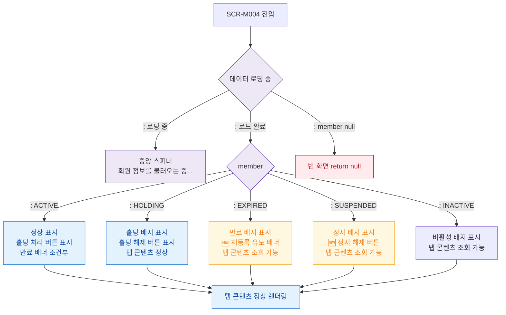

## 1. 목적

SCR-M004의 회원 상태(ACTIVE/HOLDING/EXPIRED/SUSPENDED)와 UI 로딩/에러 상태별 화면 분기를 정의한다.

## 2. 전제조건

- SCR-M004 진입 시도

## 3. 다이어그램

## 4. 엣지 설명

| 조건 | 화면 상태 | |---------|------|-----------| | | 데이터 로딩 중 | 중앙 스피너 | | | 로드 완료 | member 분기 | | | member null | 빈 화면 | | | ACTIVE | 정상 + 홀딩 처리 버튼 | | | HOLDING | 홀딩 배지 + 홀딩 해제 버튼 | | | EXPIRED | 만료 배지 + 🆕 재등록 배너 | | | SUSPENDED | 정지 배지 + 🆕 정지 해제 버튼 | | | INACTIVE | 비활성 배지 |
