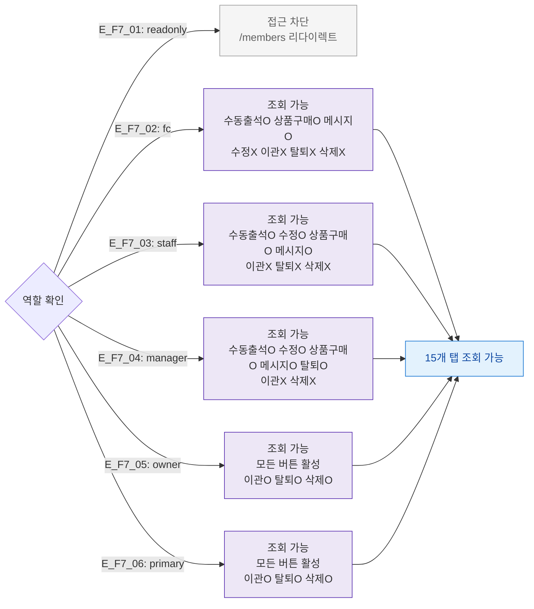

## 1. 목적

SCR-M004에서 6개 역할별 접근/액션 가능 범위를 정의한다.

## 2. 전제조건

- 로그인 세션 유효

## 3. 다이어그램

## 4. 엣지 설명

| 엣지 ID | 역할 | 접근 범위 |
|---------|------|-----------|
| E_F7_01 | readonly | 접근 완전 차단 |
| E_F7_02 | fc | 조회+수동출석+상품구매+메시지만 가능 |
| E_F7_03 | staff | 조회+수정+수동출석+상품구매+메시지 가능 |
| E_F7_04 | manager | 조회+수정+수동출석+상품구매+메시지+탈퇴 가능 |
| E_F7_05 | owner | 전체 버튼 가능 |
| E_F7_06 | primary | 전체 버튼 가능 |

## 5. TC 후보

| TC ID | 타입 | Given | When | Then |
|-------|:----:|-------|------|------|
| TC-M004-F7-01 | negative P0 | readonly 로그인 | SCR-M004 접근 | 차단, /members 이동 |
| TC-M004-F7-02 | negative P1 | fc 로그인 | 수정 버튼 클릭 | 권한없음 |
| TC-M004-F7-03 | negative P1 | manager 로그인 | 지점이관 클릭 | 권한없음 |
| TC-M004-F7-04 | positive P1 | primary 로그인 | 회원 삭제 클릭 | DLG-M002 열림 |
