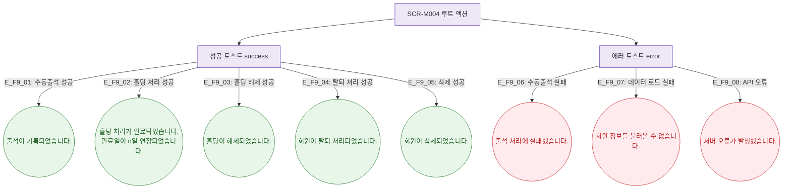

## 1. 목적

SCR-M004 루트(프로필 헤더/하단 상태관리)에서 발생하는 모든 토스트 메시지의 발생 조건을 정의한다.

## 2. 전제조건

- SCR-M004 데이터 로드 완료

## 3. 다이어그램

## 4. 엣지 설명

| 엣지 ID | 상황 | 타입 | 메시지 |
|---------|------|------|--------|
| E_F9_01 | 수동출석 성공 | success | "출석이 기록되었습니다." |
| E_F9_02 | 홀딩 처리 성공 | success | "홀딩 처리가 완료되었습니다. 만료일이 {n}일 연장되었습니다." |
| E_F9_03 | 홀딩 해제 성공 | success | "홀딩이 해제되었습니다." |
| E_F9_04 | 탈퇴 처리 성공 | success | "회원이 탈퇴 처리되었습니다." |
| E_F9_05 | 삭제 성공 | success | "회원이 삭제되었습니다." |
| E_F9_06 | 수동출석 실패 | error | "출석 처리에 실패했습니다." |
| E_F9_07 | 데이터 로드 실패 | error | "회원 정보를 불러올 수 없습니다." |
| E_F9_08 | API 오류 | error | "서버 오류가 발생했습니다." |

## 5. TC 후보

| TC ID | 타입 | Given | When | Then |
|-------|:----:|-------|------|------|
| TC-M004-F9-01 | positive P0 | ACTIVE 회원 | 수동출석 저장 성공 | success 토스트 표시 |
| TC-M004-F9-02 | positive P0 | ACTIVE 회원 | 홀딩 처리 성공 | success 토스트 + 만료일 연장 문구 |
| TC-M004-F9-03 | negative P1 | 수동출석 API 500 | 저장 시도 | error 토스트 표시 |
