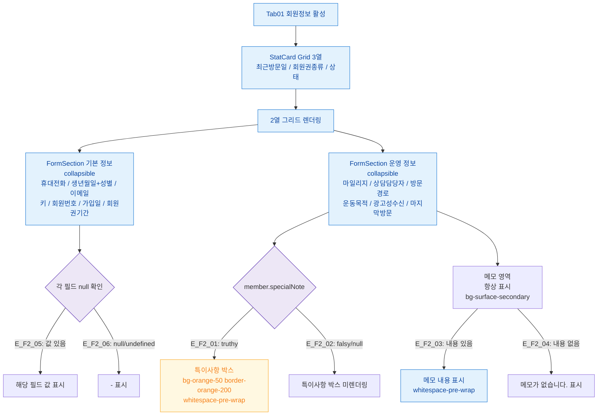

## 1. 목적

회원정보 탭(SCR-M004-01)의 기본정보/운영정보 섹션 표시 Happy Path를 정의한다.

## 2. 전제조건

- SCR-M004 진입 완료, tab=info 활성

## 3. 다이어그램

## 4. 엣지 설명

| 엣지 ID | 조건 | 결과 |
|---------|------|------|
| E_F2_01 | specialNote truthy | 특이사항 박스 렌더링 (bg-orange-50) |
| E_F2_02 | specialNote falsy | 특이사항 박스 미렌더링 |
| E_F2_03 | 메모 내용 있음 | 메모 내용 whitespace-pre-wrap 표시 |
| E_F2_04 | 메모 내용 없음 | "메모가 없습니다." 표시 |
| E_F2_05 | 필드 값 존재 | 값 표시 |
| E_F2_06 | 필드 null/undefined | "-" 표시 |

## 5. TC 후보

| TC ID | 타입 | Given | When | Then |
|-------|:----:|-------|------|------|
| TC-M004-01-F2-01 | positive P0 | 모든 필드 있는 회원 | 회원정보 탭 진입 | 기본정보/운영정보 모두 표시 |
| TC-M004-01-F2-02 | positive P1 | specialNote 있는 회원 | 탭 진입 | 주황 배경 특이사항 박스 표시 |
| TC-M004-01-F2-03 | positive P1 | specialNote 없는 회원 | 탭 진입 | 특이사항 박스 미표시 |
| TC-M004-01-F2-04 | positive P1 | 메모 없는 회원 | 탭 진입 | "메모가 없습니다." 표시 |
| TC-M004-01-F2-05 | positive P2 | 필드 일부 null | 탭 진입 | null 필드 "-" 표시 |
