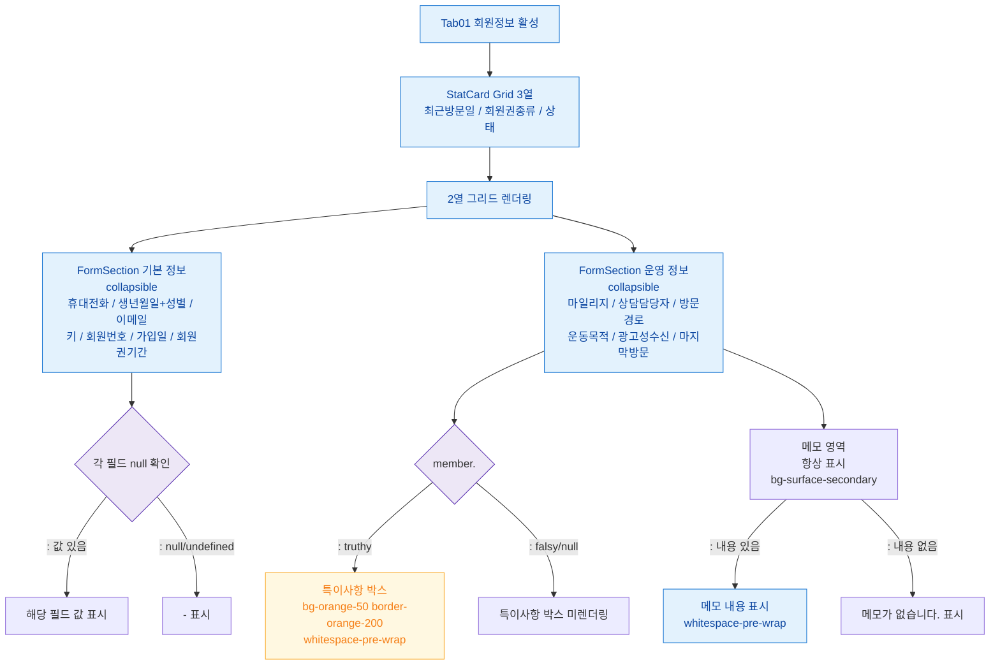

## 1. 목적

회원정보 탭(SCR-M004-01)의 기본정보/운영정보 섹션 표시 Happy Path를 정의한다.

## 2. 전제조건

- SCR-M004 진입 완료, tab=info 활성

## 3. 다이어그램

## 4. 엣지 설명

| 조건 | 결과 | |---------|------|------| | | truthy | 특이사항 박스 렌더링 (bg-orange-50) | | | falsy | 특이사항 박스 미렌더링 | | | 메모 내용 있음 | 메모 내용 whitespace-pre-wrap 표시 | | | 메모 내용 없음 | "메모가 없습니다." 표시 | | | 필드 값 존재 | 값 표시 | | | 필드 null/undefined | "-" 표시 |
