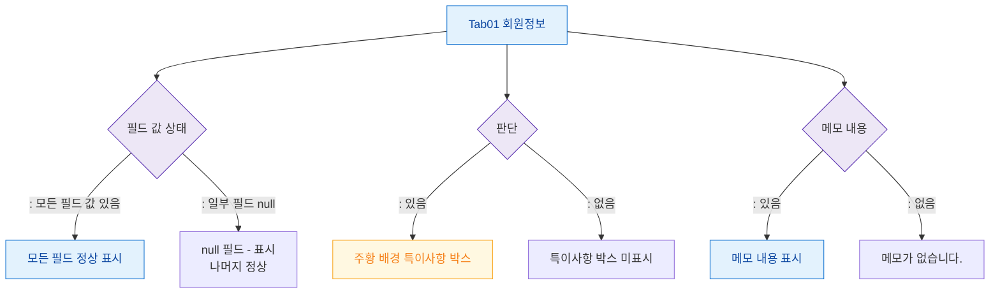

## 1. 목적

회원정보 탭의 데이터 상태별(필드 값 있음/없음/특이사항/메모) 화면 분기를 정의한다.

## 2. 전제조건

- Tab01 회원정보 활성

## 3. 다이어그램

## 4. 엣지 설명

| 조건 | 화면 | |---------|------|------| | | 모든 필드 값 있음 | 정상 표시 | | | 일부 필드 null | null 필드 "-" | | | 있음 | 주황 특이사항 박스 | | | 없음 | 박스 미표시 | | | 메모 있음 | 메모 표시 | | | 메모 없음 | "메모가 없습니다." |
