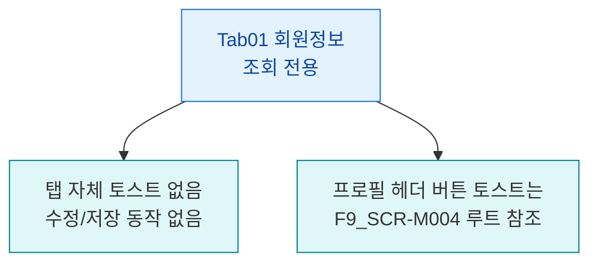

## 1. 목적

회원정보 탭에서 발생하는 토스트를 정의한다. 조회 전용 탭이므로 탭 자체 토스트 없음.

## 2. 전제조건

- Tab01 회원정보 활성

## 3. 다이어그램

```mermaid
flowchart TD
  TAB[Tab01 회원정보\n조회 전용] --> NONE[탭 자체 토스트 없음\n수정/저장 동작 없음]
  TAB --> NOTE[프로필 헤더 버튼 토스트는\nF9_SCR-M004 루트 참조]

  classDef screen fill:#E3F2FD,stroke:#1976D2,color:#0D47A1
  classDef info fill:#E0F7FA,stroke:#00838F
  class TAB screen
  class NONE,NOTE info
```

## 4. 엣지 설명

회원정보 탭 자체 토스트 없음. 관련 토스트는 루트 F9 참조.

## 5. TC 후보

해당 없음 (조회 전용 탭).
