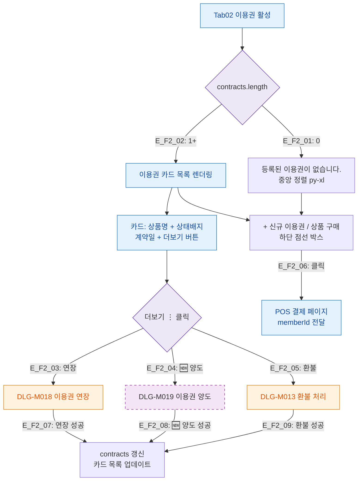

## 1. 목적

이용권 탭(SCR-M004-02)의 계약 카드 목록 표시 및 신규 구매 플로우를 정의한다.

## 2. 전제조건

- SCR-M004 진입 완료, tab=tickets 활성
- contracts 데이터 로드 완료

## 3. 다이어그램

## 4. 엣지 설명

| 엣지 ID | 조건/액션 | 결과 |
|---------|-----------|------|
| E_F2_01 | contracts.length=0 | 빈 상태 메시지 |
| E_F2_02 | contracts.length>0 | 카드 목록 렌더링 |
| E_F2_03 | 더보기 > 연장 | DLG-M018 열기 |
| E_F2_04 | 더보기 > 🆕 양도 | DLG-M019 열기 |
| E_F2_05 | 더보기 > 환불 | DLG-M013 열기 |
| E_F2_06 | 신규 이용권 버튼 클릭 | POS 페이지 이동 |
| E_F2_07 | 연장 성공 | 카드 목록 갱신 |
| E_F2_08 | 🆕 양도 성공 | 카드 목록 갱신 |
| E_F2_09 | 환불 성공 | 카드 목록 갱신 |

## 5. TC 후보

| TC ID | 타입 | Given | When | Then |
|-------|:----:|-------|------|------|
| TC-M004-02-F2-01 | positive P0 | 이용권 없는 회원 | 이용권 탭 진입 | "등록된 이용권이 없습니다." 표시 |
| TC-M004-02-F2-02 | positive P0 | 이용권 있는 회원 | 탭 진입 | 카드 목록 표시 |
| TC-M004-02-F2-03 | positive P0 | 이용중 계약 | 더보기 > 연장 클릭 | DLG-M018 열림 |
| TC-M004-02-F2-04 | positive P1 | 이용중 계약 | 더보기 > 환불 클릭 | DLG-M013 열림 |
| TC-M004-02-F2-05 | positive P1 | 모든 상태 | 신규 이용권 버튼 클릭 | POS 페이지 이동 |
