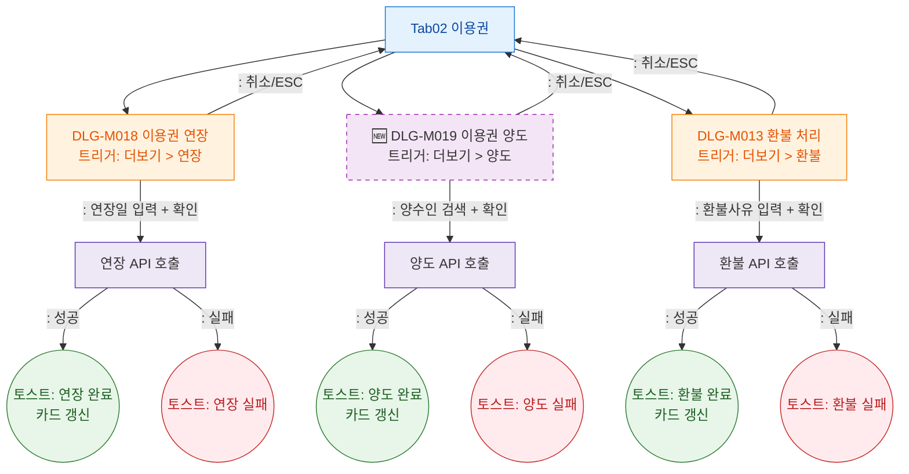

## 1. 목적

이용권 탭에서 트리거되는 모달(DLG-M018 연장, DLG-M019 양도, DLG-M013 환불)의 전체 생명주기를 정의한다.

## 2. 전제조건

- Tab02 이용권 활성, 카드 렌더링 완료

## 3. 다이어그램

## 4. 엣지 설명

| 모달 | 결과 | |---------|------|------| | ~04 | DLG-M018 연장 | 입력→API→성공/실패/취소 | | ~08 | 🆕 DLG-M019 양도 | 양수인검색→API→성공/실패/취소 | | ~12 | DLG-M013 환불 | 사유입력→API→성공/실패/취소 |
