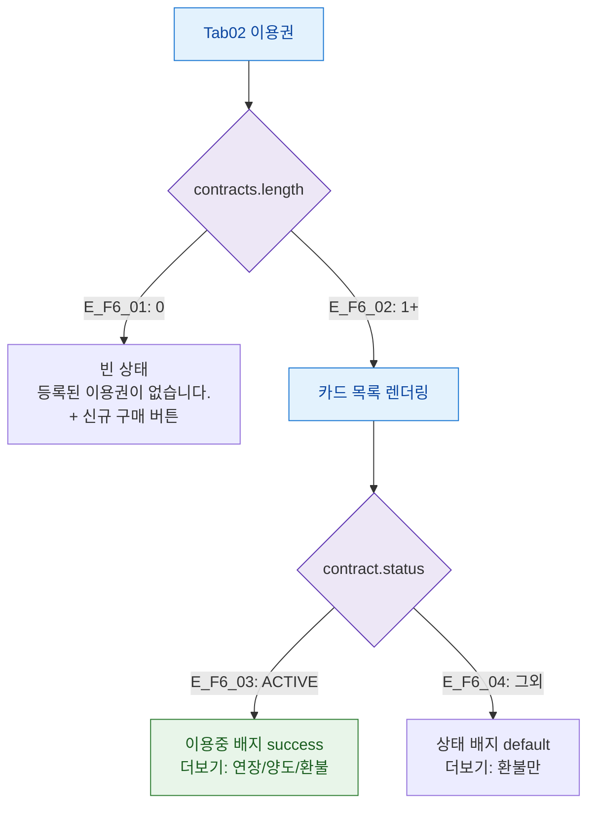

## 1. 목적

이용권 탭의 계약 상태(없음/이용중/만료)별 화면 분기를 정의한다.

## 2. 전제조건

- Tab02 이용권 활성

## 3. 다이어그램

## 4. 엣지 설명

| 엣지 ID | 조건 | 화면 |
|---------|------|------|
| E_F6_01 | contracts 없음 | 빈 상태 메시지 + 구매 버튼 |
| E_F6_02 | contracts 있음 | 카드 목록 |
| E_F6_03 | ACTIVE 계약 | 이용중 배지, 연장/양도/환불 메뉴 |
| E_F6_04 | 비활성 계약 | 상태 배지, 환불만 표시 |

## 5. TC 후보

| TC ID | 타입 | Given | When | Then |
|-------|:----:|-------|------|------|
| TC-M004-02-F6-01 | positive P0 | 이용권 없음 | 탭 진입 | 빈 상태 메시지 |
| TC-M004-02-F6-02 | positive P0 | ACTIVE 이용권 | 탭 진입 | 이용중 배지, 더보기 메뉴 표시 |
