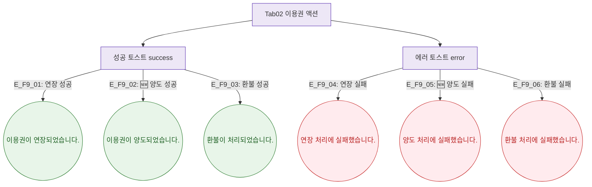

## 1. 목적

이용권 탭에서 발생하는 토스트 메시지 조건을 정의한다.

## 2. 전제조건

- Tab02 이용권 활성

## 3. 다이어그램

## 4. 엣지 설명

| 엣지 ID | 상황 | 타입 | 메시지 |
|---------|------|------|--------|
| E_F9_01 | 연장 성공 | success | 이용권이 연장되었습니다. |
| E_F9_02 | 🆕 양도 성공 | success | 이용권이 양도되었습니다. |
| E_F9_03 | 환불 성공 | success | 환불이 처리되었습니다. |
| E_F9_04 | 연장 실패 | error | 연장 처리에 실패했습니다. |
| E_F9_05 | 🆕 양도 실패 | error | 양도 처리에 실패했습니다. |
| E_F9_06 | 환불 실패 | error | 환불 처리에 실패했습니다. |

## 5. TC 후보

| TC ID | 타입 | Given | When | Then |
|-------|:----:|-------|------|------|
| TC-M004-02-F9-01 | positive P0 | 이용중 계약 | 연장 성공 | success 토스트 |
| TC-M004-02-F9-02 | negative P1 | 연장 API 500 | 연장 시도 | error 토스트 |
