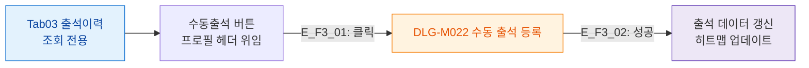

## 1. 목적

출석이력 탭의 버튼을 정의한다. 조회 전용 탭이며 수동출석은 헤더 버튼을 통해 진행.

## 2. 전제조건

- Tab03 출석이력 활성

## 3. 다이어그램

## 4. 엣지 설명

| 엣지 ID | 버튼 | 동작 |
|---------|------|------|
| E_F3_01 | 수동출석 (헤더) | DLG-M022 열기 |
| E_F3_02 | 수동출석 성공 | 출석 데이터 갱신 |

## 5. TC 후보

| TC ID | 타입 | Given | When | Then |
|-------|:----:|-------|------|------|
| TC-M004-03-F3-01 | positive P0 | 출석이력 탭 활성 | 수동출석 버튼 클릭 후 저장 | 히트맵 셀 업데이트, 리스트 갱신 |
