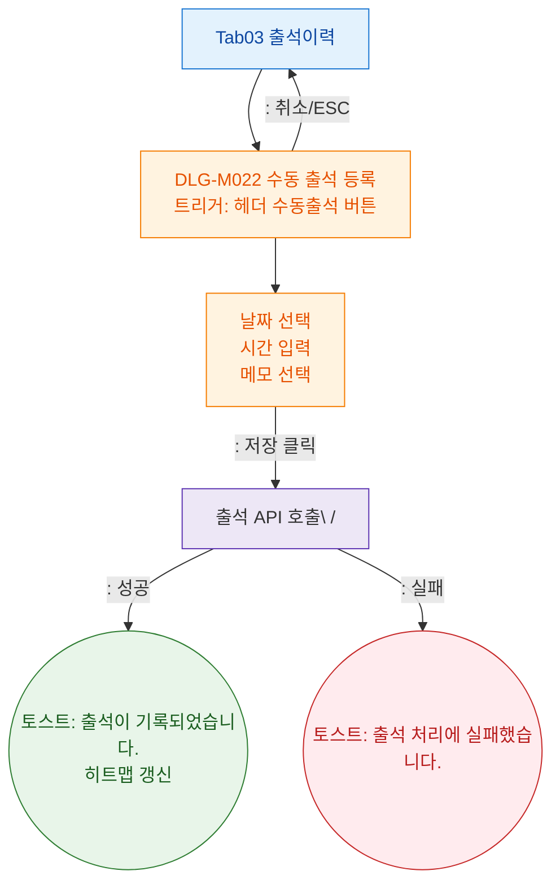

## 1. 목적

출석이력 탭에서 트리거되는 모달(DLG-M022 수동출석)을 정의한다.

## 2. 전제조건

- Tab03 출석이력 활성

## 3. 다이어그램

## 4. 엣지 설명

| 단계 | 결과 | |---------|------|------| | | 저장 클릭 | 출석 API 호출 | | | API 성공 | 토스트 + 히트맵 갱신 | | | API 실패 | 에러 토스트 | | | 취소/ESC | 모달 닫기 |
