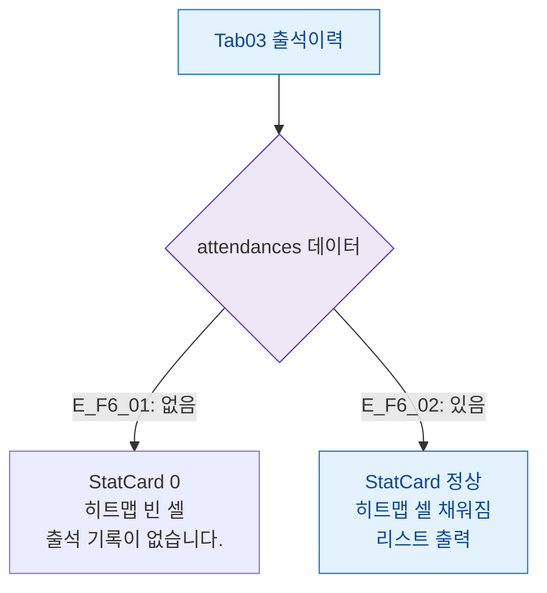

## 1. 목적

출석이력 탭의 데이터 상태별 화면 분기를 정의한다.

## 2. 전제조건

- Tab03 출석이력 활성

## 3. 다이어그램

## 4. 엣지 설명

| 엣지 ID | 조건 | 화면 |
|---------|------|------|
| E_F6_01 | 출석 없음 | 0값 StatCard, 빈 히트맵, 빈 상태 메시지 |
| E_F6_02 | 출석 있음 | 정상 히트맵 + 리스트 |

## 5. TC 후보

| TC ID | 타입 | Given | When | Then |
|-------|:----:|-------|------|------|
| TC-M004-03-F6-01 | positive P1 | 출석 없음 | 탭 진입 | 빈 상태 표시 |
| TC-M004-03-F6-02 | positive P0 | 출석 있음 | 탭 진입 | 히트맵 + 리스트 정상 |
