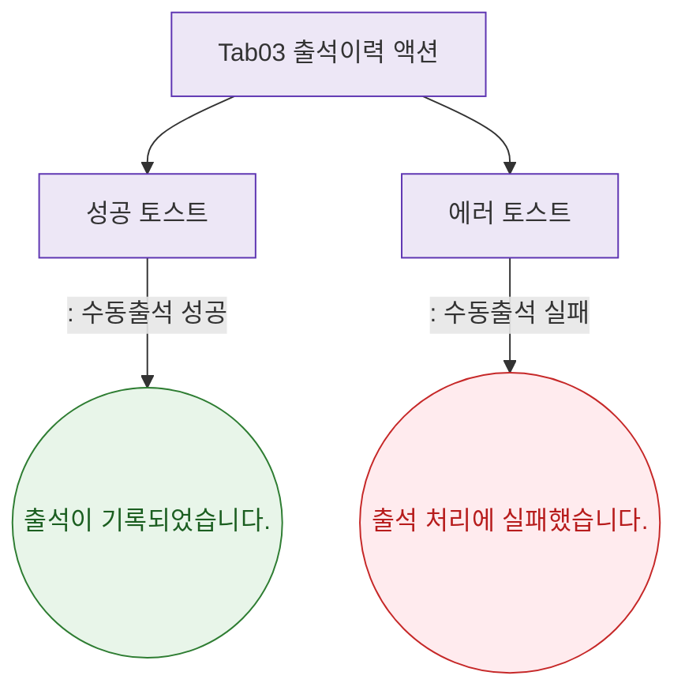

## 1. 목적

출석이력 탭에서 발생하는 토스트를 정의한다.

## 2. 전제조건

- Tab03 출석이력 활성

## 3. 다이어그램

## 4. 엣지 설명

| 상황 | 타입 | 메시지 | |---------|------|------|--------| | | 수동출석 성공 | success | "출석이 기록되었습니다." | | | 수동출석 실패 | error | "출석 처리에 실패했습니다." |
