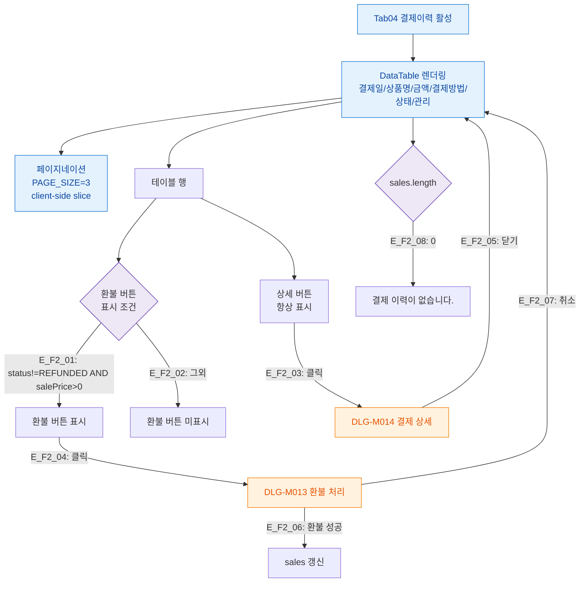

## 1. 목적

결제이력 탭(SCR-M004-04)의 결제 테이블 표시 및 상세/환불 버튼 플로우를 정의한다.

## 2. 전제조건

- tab=payment 활성, sales 데이터 로드 완료

## 3. 다이어그램

## 4. 엣지 설명

| 엣지 ID | 조건 | 결과 |
|---------|------|------|
| E_F2_01 | status!=REFUNDED AND salePrice>0 | 환불 버튼 표시 |
| E_F2_02 | REFUNDED 또는 salePrice<=0 | 환불 버튼 미표시 |
| E_F2_03 | 상세 버튼 클릭 | DLG-M014 열기 |
| E_F2_04 | 환불 버튼 클릭 | DLG-M013 열기 |
| E_F2_05 | 상세 모달 닫기 | 테이블 유지 |
| E_F2_06 | 환불 성공 | sales 갱신 |
| E_F2_07 | 환불 취소 | 테이블 유지 |
| E_F2_08 | 결제 없음 | 빈 상태 메시지 |

## 5. TC 후보

| TC ID | 타입 | Given | When | Then |
|-------|:----:|-------|------|------|
| TC-M004-04-F2-01 | positive P0 | 결제 있는 회원 | 결제이력 탭 진입 | 테이블 정상 표시 |
| TC-M004-04-F2-02 | positive P1 | 완료 결제 건 | 상세 버튼 클릭 | DLG-M014 열림 |
| TC-M004-04-F2-03 | positive P1 | 완료 결제 건 | 환불 버튼 클릭 | DLG-M013 열림 |
| TC-M004-04-F2-04 | positive P1 | REFUNDED 건 | 행 확인 | 환불 버튼 미표시 |
