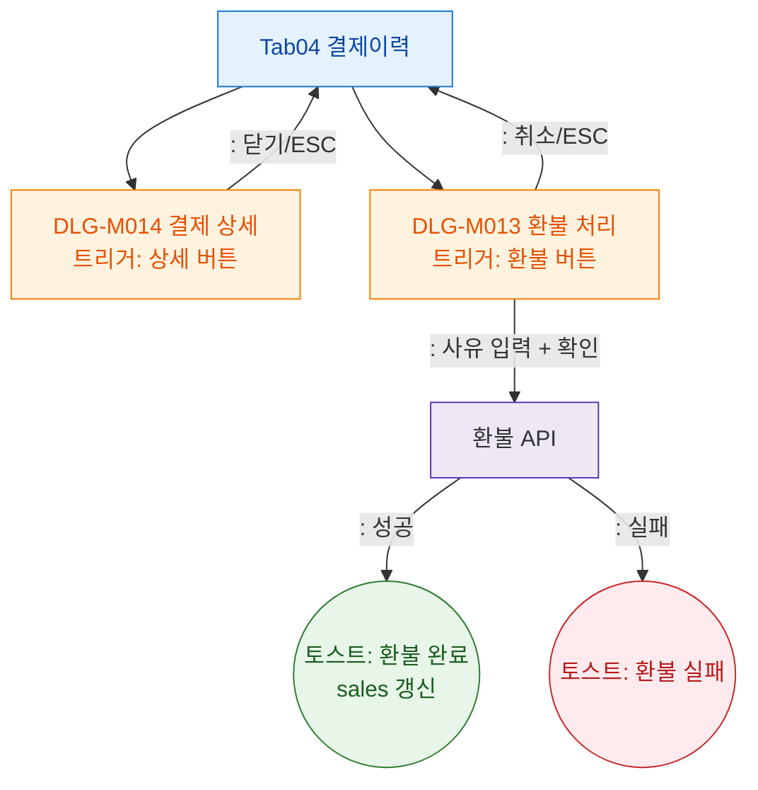

## 1. 목적

결제이력 탭에서 트리거되는 모달을 정의한다.

## 2. 전제조건

- Tab04 결제이력 활성

## 3. 다이어그램

## 4. 엣지 설명

| 단계 | 결과 | |---------|------|------| | | 상세 모달 닫기 | 모달 닫힘 | | | 환불 확인 | 환불 API | | | 환불 성공 | 토스트 + 갱신 | | | 환불 실패 | 에러 토스트 | | | 취소/ESC | 모달 닫힘 |
