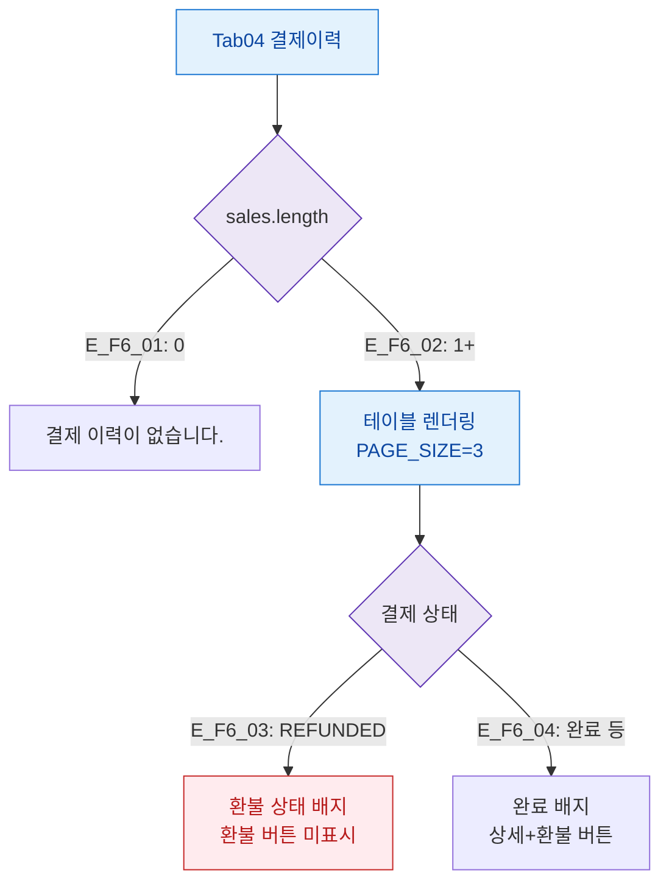

## 1. 목적

결제이력 탭의 데이터 상태별 화면 분기를 정의한다.

## 2. 전제조건

- Tab04 결제이력 활성

## 3. 다이어그램

## 4. 엣지 설명

| 엣지 ID | 조건 | 화면 |
|---------|------|------|
| E_F6_01 | 결제 없음 | 빈 상태 메시지 |
| E_F6_02 | 결제 있음 | 테이블 + 페이지네이션 |
| E_F6_03 | REFUNDED | 환불 배지, 환불 버튼 미표시 |
| E_F6_04 | 완료 상태 | 완료 배지, 상세+환불 버튼 |

## 5. TC 후보

| TC ID | 타입 | Given | When | Then |
|-------|:----:|-------|------|------|
| TC-M004-04-F6-01 | positive P1 | 결제 없음 | 탭 진입 | "결제 이력이 없습니다." |
