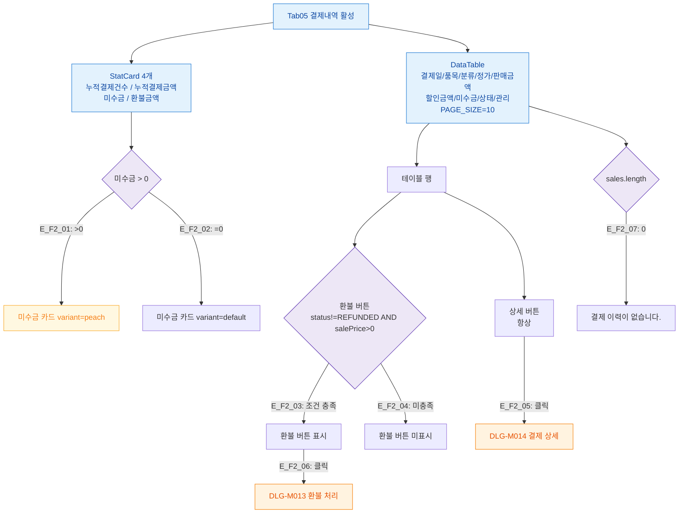

## 1. 목적

결제내역 탭(SCR-M004-05)의 통계 카드 4개 + 상세 테이블 플로우를 정의한다.

## 2. 전제조건

- tab=payment_detail 활성, sales 데이터 로드 완료

## 3. 다이어그램

## 4. 엣지 설명

| 엣지 ID | 조건 | 결과 |
|---------|------|------|
| E_F2_01 | 미수금 > 0 | 미수금 카드 peach 강조 |
| E_F2_02 | 미수금 = 0 | 미수금 카드 기본 |
| E_F2_03 | 환불 가능 조건 | 환불 버튼 표시 |
| E_F2_04 | 환불 불가 | 환불 버튼 미표시 |
| E_F2_05 | 상세 클릭 | DLG-M014 |
| E_F2_06 | 환불 클릭 | DLG-M013 |
| E_F2_07 | 결제 없음 | 빈 상태 |

## 5. TC 후보

| TC ID | 타입 | Given | When | Then |
|-------|:----:|-------|------|------|
| TC-M004-05-F2-01 | positive P0 | 미수금 있는 회원 | 탭 진입 | 미수금 카드 peach 강조 |
| TC-M004-05-F2-02 | positive P0 | 결제 있는 회원 | 탭 진입 | 통계 카드 + 테이블 정상 |
