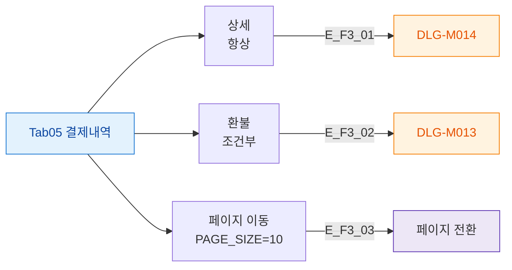

## 1. 목적

결제내역 탭의 버튼 전체를 정의한다.

## 2. 전제조건

- Tab05 결제내역 활성

## 3. 다이어그램

## 4. 엣지 설명

| 엣지 ID | 버튼 | 동작 |
|---------|------|------|
| E_F3_01 | 상세 | DLG-M014 |
| E_F3_02 | 환불 | DLG-M013 |
| E_F3_03 | 페이지 이동 | client-side 슬라이스 PAGE_SIZE=10 |

## 5. TC 후보

| TC ID | 타입 | Given | When | Then |
|-------|:----:|-------|------|------|
| TC-M004-05-F3-01 | positive P1 | 결제 11건 | 다음 페이지 | 11번째 건 표시 |
