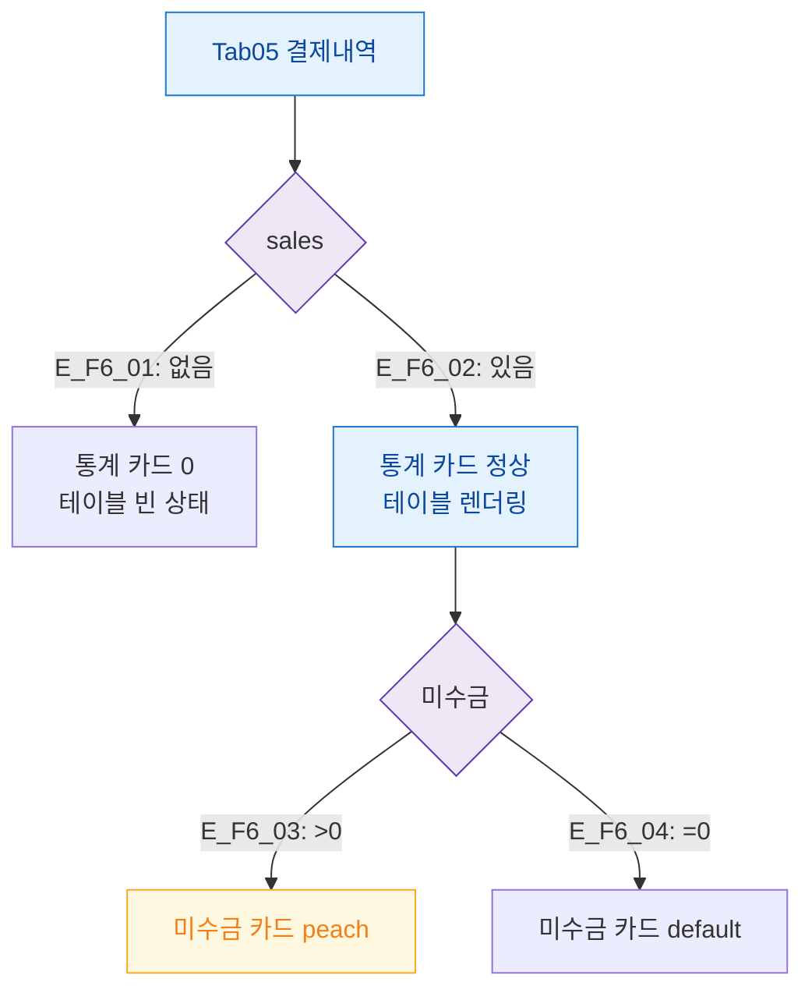

## 1. 목적

결제내역 탭의 데이터/미수금 상태별 화면 분기를 정의한다.

## 2. 전제조건

- Tab05 결제내역 활성

## 3. 다이어그램

## 4. 엣지 설명

| 엣지 ID | 조건 | 화면 |
|---------|------|------|
| E_F6_01 | 결제 없음 | 0값 카드 + 빈 테이블 |
| E_F6_02 | 결제 있음 | 정상 |
| E_F6_03 | 미수금 > 0 | peach 강조 |
| E_F6_04 | 미수금 = 0 | default |

## 5. TC 후보

| TC ID | 타입 | Given | When | Then |
|-------|:----:|-------|------|------|
| TC-M004-05-F6-01 | positive P0 | 미수금 > 0 | 탭 진입 | 미수금 카드 peach |
| TC-M004-05-F6-02 | positive P1 | 결제 없음 | 탭 진입 | 빈 상태 |
