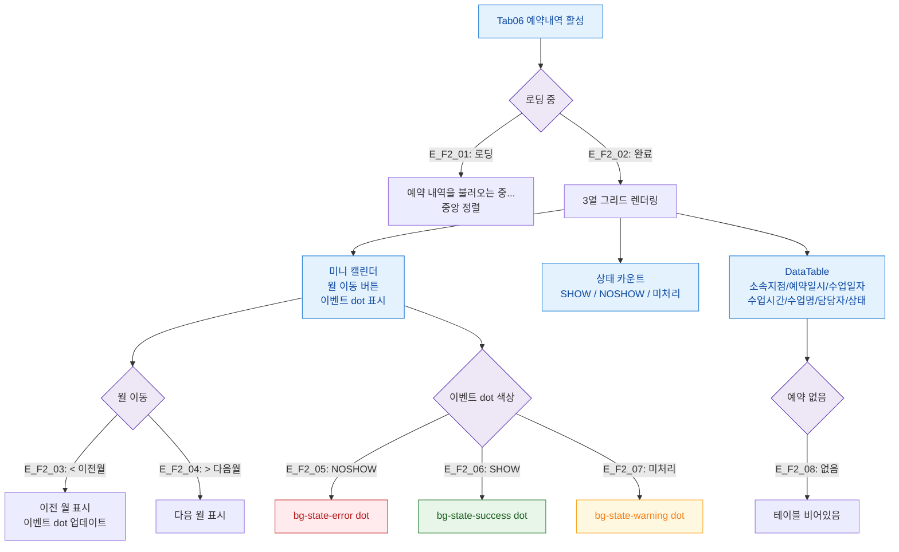

## 1. 목적

예약내역 탭(SCR-M004-06)의 미니 캘린더 + 상태 카운트 + 테이블 플로우를 정의한다.

## 2. 전제조건

- tab=reservation 활성, lesson_bookings 데이터 로드 완료

## 3. 다이어그램

## 4. 엣지 설명

| 엣지 ID | 조건 | 결과 |
|---------|------|------|
| E_F2_01 | 로딩 중 | 스피너 표시 |
| E_F2_02 | 로드 완료 | 3열 레이아웃 |
| E_F2_03 | 이전 월 버튼 | 캘린더 이전 월 |
| E_F2_04 | 다음 월 버튼 | 캘린더 다음 월 |
| E_F2_05 | NOSHOW | 빨간 dot |
| E_F2_06 | SHOW | 초록 dot |
| E_F2_07 | 미처리 | 노란 dot |
| E_F2_08 | 예약 없음 | 빈 테이블 |

## 5. TC 후보

| TC ID | 타입 | Given | When | Then |
|-------|:----:|-------|------|------|
| TC-M004-06-F2-01 | positive P0 | 예약 있는 회원 | 탭 진입 | 캘린더 + 카운트 + 테이블 표시 |
| TC-M004-06-F2-02 | positive P1 | NOSHOW 예약 | 탭 진입 | 빨간 dot 표시 |
| TC-M004-06-F2-03 | positive P1 | 예약 없음 | 탭 진입 | 빈 테이블 |
