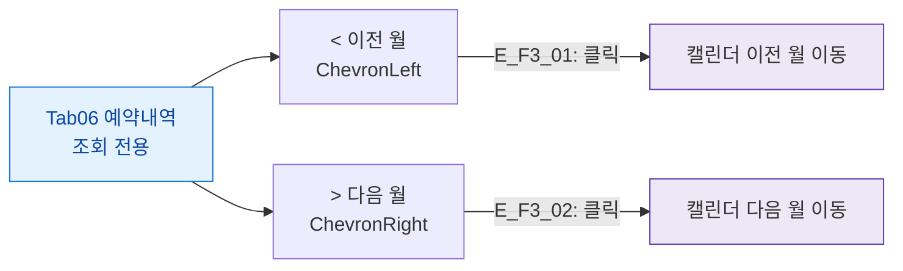

## 1. 목적

예약내역 탭의 버튼을 정의한다. 조회 전용 탭.

## 2. 전제조건

- Tab06 예약내역 활성

## 3. 다이어그램

## 4. 엣지 설명

| 엣지 ID | 버튼 | 동작 |
|---------|------|------|
| E_F3_01 | < 이전 월 | 캘린더 이전 월 |
| E_F3_02 | > 다음 월 | 캘린더 다음 월 |

## 5. TC 후보

| TC ID | 타입 | Given | When | Then |
|-------|:----:|-------|------|------|
| TC-M004-06-F3-01 | positive P2 | 예약내역 탭 | 이전 월 클릭 | 캘린더 이전 월 표시 |
