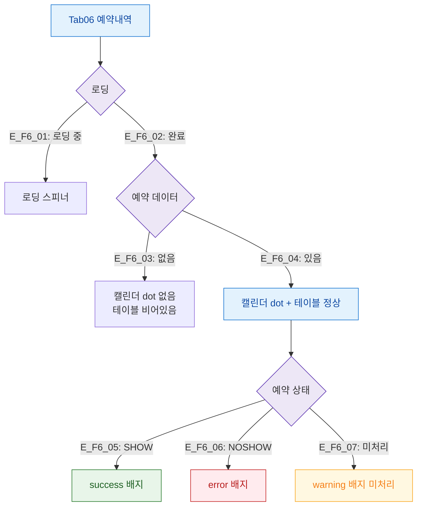

## 1. 목적

예약내역 탭의 데이터/예약 상태별 화면 분기를 정의한다.

## 2. 전제조건

- Tab06 예약내역 활성

## 3. 다이어그램

## 4. 엣지 설명

| 엣지 ID | 조건 | 화면 |
|---------|------|------|
| E_F6_01 | 로딩 중 | 스피너 |
| E_F6_02 | 로드 완료 | 레이아웃 렌더링 |
| E_F6_03 | 예약 없음 | 빈 상태 |
| E_F6_04 | 예약 있음 | 정상 |
| E_F6_05 | SHOW | success 배지 |
| E_F6_06 | NOSHOW | error 배지 |
| E_F6_07 | 미처리 | warning 배지 |

## 5. TC 후보

| TC ID | 타입 | Given | When | Then |
|-------|:----:|-------|------|------|
| TC-M004-06-F6-01 | positive P0 | NOSHOW 예약 | 탭 진입 | error 배지 + 빨간 dot |
