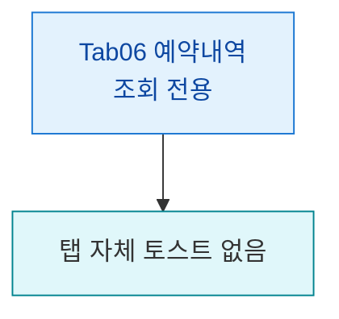

## 1. 목적

예약내역 탭의 토스트를 정의한다. 조회 전용이므로 탭 자체 토스트 없음.

## 2. 전제조건

- Tab06 예약내역 활성

## 3. 다이어그램

```mermaid
flowchart TD
  TAB[Tab06 예약내역\n조회 전용] --> NONE[탭 자체 토스트 없음]

  classDef screen fill:#E3F2FD,stroke:#1976D2,color:#0D47A1
  classDef info fill:#E0F7FA,stroke:#00838F
  class TAB screen
  class NONE info
```

## 4. 엣지 설명

조회 전용 탭으로 토스트 없음.

## 5. TC 후보

해당 없음.
