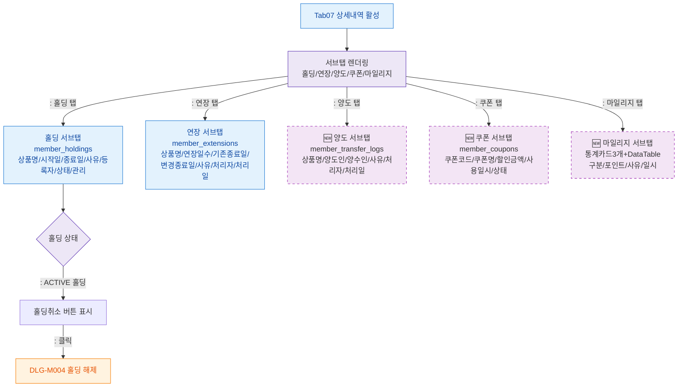

## 1. 목적

상세내역 탭(SCR-M004-07)의 5개 서브탭(홀딩/연장/양도/쿠폰/마일리지) 전환 및 각 데이터 표시 플로우를 정의한다.

## 2. 전제조건

- tab=detail_history 활성

## 3. 다이어그램

## 4. 엣지 설명

| 서브탭 | 데이터 소스 | |---------|--------|-------------| | | 홀딩 | member_holdings | | | 연장 | member_extensions | | | 🆕 양도 | member_transfer_logs | | | 🆕 쿠폰 | member_coupons | | | 🆕 마일리지 | member_mileage_logs | | | ACTIVE 홀딩 존재 | 홀딩취소 버튼 표시 | | | 홀딩취소 클릭 | DLG-M004 열기 |
