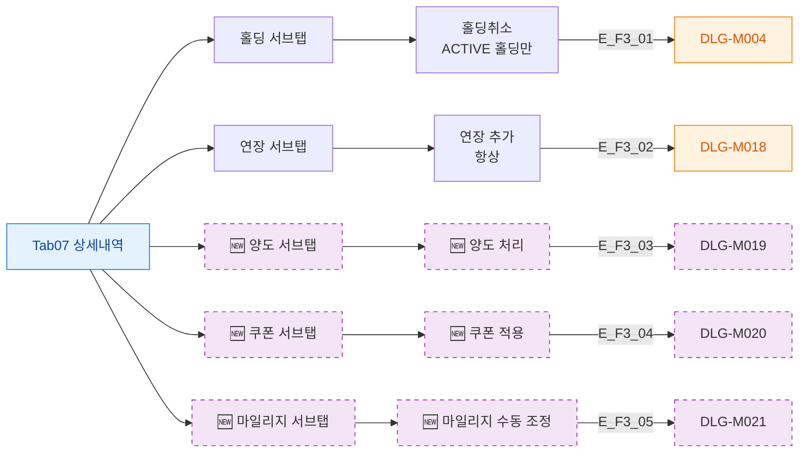

## 1. 목적

상세내역 탭 5개 서브탭의 버튼 전체를 정의한다.

## 2. 전제조건

- Tab07 상세내역 활성

## 3. 다이어그램

## 4. 엣지 설명

| 엣지 ID | 버튼 | 동작 |
|---------|------|------|
| E_F3_01 | 홀딩취소 | DLG-M004 |
| E_F3_02 | 연장 추가 | DLG-M018 |
| E_F3_03 | 🆕 양도 처리 | DLG-M019 |
| E_F3_04 | 🆕 쿠폰 적용 | DLG-M020 |
| E_F3_05 | 🆕 마일리지 조정 | DLG-M021 |

## 5. TC 후보

| TC ID | 타입 | Given | When | Then |
|-------|:----:|-------|------|------|
| TC-M004-07-F3-01 | positive P1 | ACTIVE 홀딩 | 홀딩취소 클릭 | DLG-M004 열림 |
| TC-M004-07-F3-02 | positive P1 | 연장 탭 | 연장 추가 클릭 | DLG-M018 열림 |
