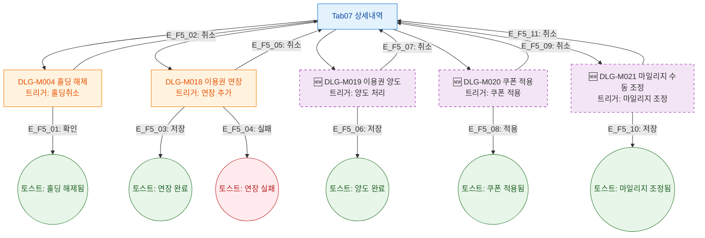

## 1. 목적

상세내역 탭 5개 서브탭에서 트리거되는 모달 전체를 정의한다.

## 2. 전제조건

- Tab07 상세내역 활성

## 3. 다이어그램

## 4. 엣지 설명

| 엣지 ID | 모달 | 결과 |
|---------|------|------|
| E_F5_01~02 | DLG-M004 홀딩 해제 | 확인/취소 |
| E_F5_03~05 | DLG-M018 연장 | 저장/실패/취소 |
| E_F5_06~07 | 🆕 DLG-M019 양도 | 저장/취소 |
| E_F5_08~09 | 🆕 DLG-M020 쿠폰 | 적용/취소 |
| E_F5_10~11 | 🆕 DLG-M021 마일리지 | 저장/취소 |

## 5. TC 후보

| TC ID | 타입 | Given | When | Then |
|-------|:----:|-------|------|------|
| TC-M004-07-F5-01 | positive P1 | ACTIVE 홀딩 | 홀딩취소 확인 | 홀딩 해제 토스트 |
| TC-M004-07-F5-02 | positive P1 | 연장 탭 | 연장 저장 | 연장 완료 토스트, 목록 갱신 |
