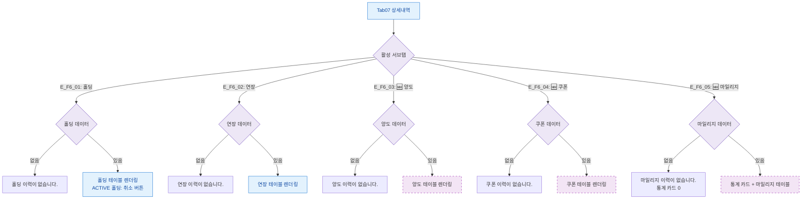

## 1. 목적

상세내역 탭 서브탭별 빈/데이터 상태 분기를 정의한다.

## 2. 전제조건

- Tab07 상세내역 활성

## 3. 다이어그램

## 4. 엣지 설명

각 서브탭별 데이터 없음/있음 분기.

## 5. TC 후보

| TC ID | 타입 | Given | When | Then |
|-------|:----:|-------|------|------|
| TC-M004-07-F6-01 | positive P1 | 홀딩 없음 | 홀딩 탭 | "홀딩 이력이 없습니다." |
