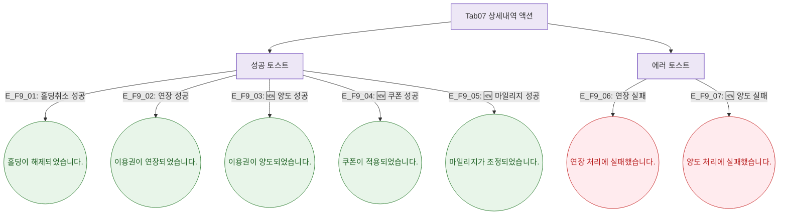

## 1. 목적

상세내역 탭 5개 서브탭 액션의 토스트 메시지를 정의한다.

## 2. 전제조건

- Tab07 상세내역 활성

## 3. 다이어그램

## 4. 엣지 설명

| 엣지 ID | 상황 | 타입 | 메시지 |
|---------|------|------|--------|
| E_F9_01 | 홀딩취소 성공 | success | "홀딩이 해제되었습니다." |
| E_F9_02 | 연장 성공 | success | "이용권이 연장되었습니다." |
| E_F9_03 | 🆕 양도 성공 | success | "이용권이 양도되었습니다." |
| E_F9_04 | 🆕 쿠폰 성공 | success | "쿠폰이 적용되었습니다." |
| E_F9_05 | 🆕 마일리지 성공 | success | "마일리지가 조정되었습니다." |
| E_F9_06 | 연장 실패 | error | "연장 처리에 실패했습니다." |
| E_F9_07 | 🆕 양도 실패 | error | "양도 처리에 실패했습니다." |

## 5. TC 후보

| TC ID | 타입 | Given | When | Then |
|-------|:----:|-------|------|------|
| TC-M004-07-F9-01 | positive P1 | ACTIVE 홀딩 | 홀딩취소 | success 토스트 |
