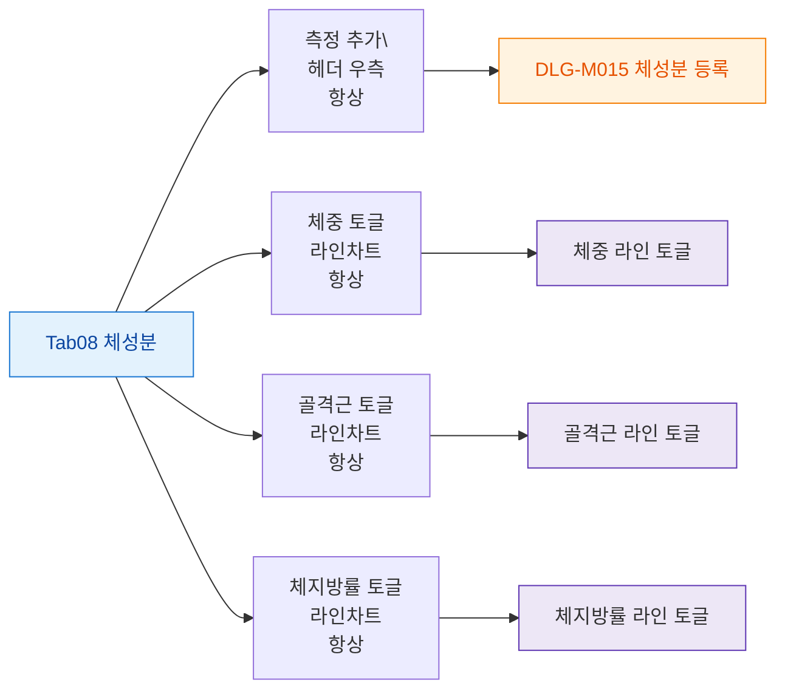

## 1. 목적

체성분 탭의 버튼 전체를 정의한다.

## 2. 전제조건

- Tab08 체성분 활성

## 3. 다이어그램

## 4. 엣지 설명

| 버튼 | 동작 | |---------|------|------| | | 측정 추가 | DLG-M015 열기 | | | 체중 토글 | 체중 라인 on/off | | | 골격근 토글 | 골격근 라인 on/off | | | 체지방률 토글 | 체지방률 라인 on/off |
