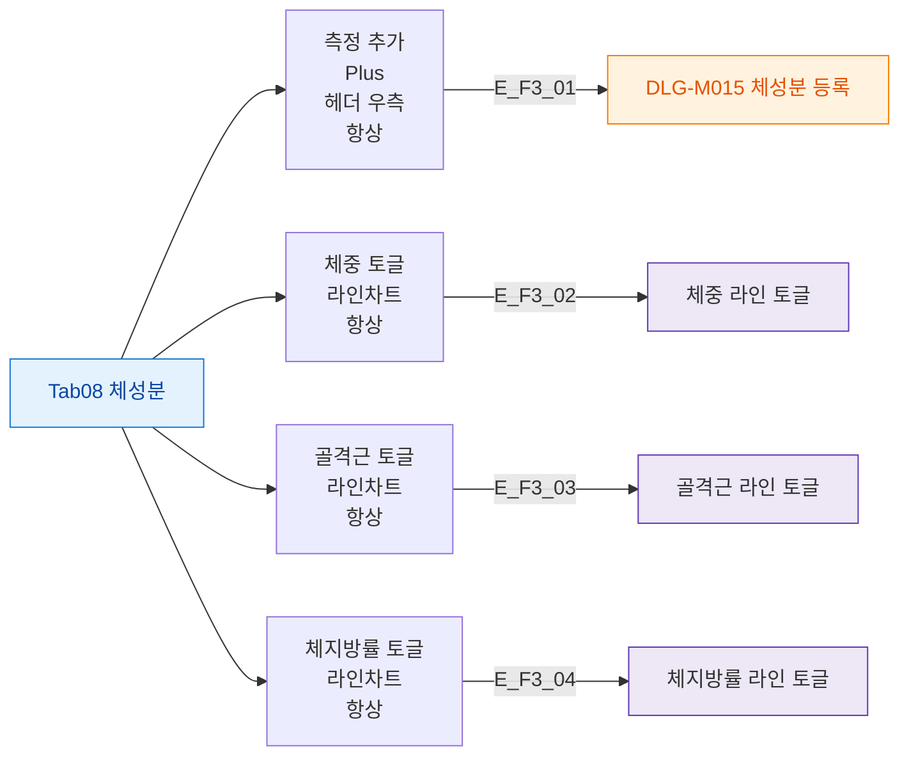

## 1. 목적

체성분 탭의 버튼 전체를 정의한다.

## 2. 전제조건

- Tab08 체성분 활성

## 3. 다이어그램

## 4. 엣지 설명

| 엣지 ID | 버튼 | 동작 |
|---------|------|------|
| E_F3_01 | 측정 추가 | DLG-M015 열기 |
| E_F3_02 | 체중 토글 | 체중 라인 on/off |
| E_F3_03 | 골격근 토글 | 골격근 라인 on/off |
| E_F3_04 | 체지방률 토글 | 체지방률 라인 on/off |

## 5. TC 후보

| TC ID | 타입 | Given | When | Then |
|-------|:----:|-------|------|------|
| TC-M004-08-F3-01 | positive P0 | 체성분 탭 | 측정 추가 클릭 | DLG-M015 열림 |
