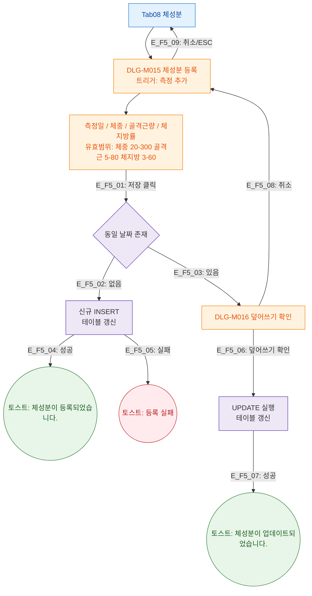

## 1. 목적

체성분 탭에서 트리거되는 DLG-M015/M016 모달 생명주기를 정의한다.

## 2. 전제조건

- Tab08 체성분 활성

## 3. 다이어그램

## 4. 엣지 설명

| 엣지 ID | 단계 | 결과 |
|---------|------|------|
| E_F5_01 | 저장 클릭 | 날짜 중복 확인 |
| E_F5_02 | 신규 날짜 | INSERT |
| E_F5_03 | 동일 날짜 | DLG-M016 |
| E_F5_04 | INSERT 성공 | 토스트 |
| E_F5_05 | INSERT 실패 | 에러 토스트 |
| E_F5_06 | 덮어쓰기 확인 | UPDATE |
| E_F5_07 | UPDATE 성공 | 토스트 |
| E_F5_08 | 덮어쓰기 취소 | DLG-M015 복귀 |
| E_F5_09 | 취소/ESC | 모달 닫기 |

## 5. TC 후보

| TC ID | 타입 | Given | When | Then |
|-------|:----:|-------|------|------|
| TC-M004-08-F5-01 | positive P0 | 신규 날짜 | 측정 저장 | 등록 토스트, 테이블 갱신 |
| TC-M004-08-F5-02 | positive P1 | 동일 날짜 | 측정 저장 | DLG-M016 덮어쓰기 확인 표시 |
