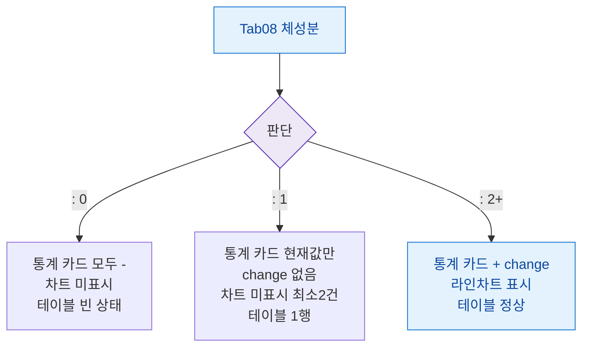

## 1. 목적

체성분 탭의 데이터 건수별 화면 상태 분기를 정의한다.

## 2. 전제조건

- Tab08 체성분 활성

## 3. 다이어그램

## 4. 엣지 설명

| 건수 | 화면 | |---------|------|------| | | 0건 | 모두 빈 상태 | | | 1건 | change 없음, 차트 미표시 | | | 2건+ | 전체 표시 |
