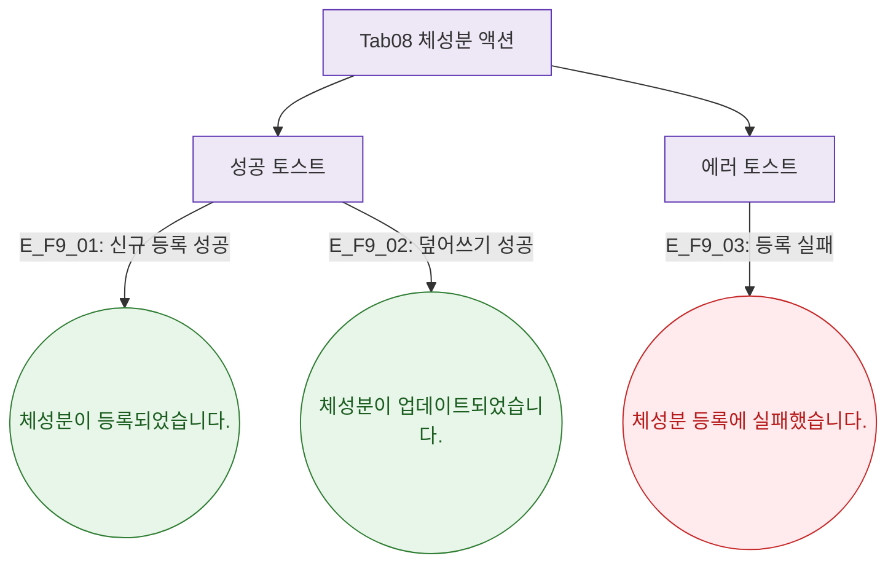

## 1. 목적

체성분 탭에서 발생하는 토스트를 정의한다.

## 2. 전제조건

- Tab08 체성분 활성

## 3. 다이어그램

## 4. 엣지 설명

| 엣지 ID | 상황 | 타입 | 메시지 |
|---------|------|------|--------|
| E_F9_01 | 신규 등록 성공 | success | "체성분이 등록되었습니다." |
| E_F9_02 | 덮어쓰기 성공 | success | "체성분이 업데이트되었습니다." |
| E_F9_03 | 등록 실패 | error | "체성분 등록에 실패했습니다." |

## 5. TC 후보

| TC ID | 타입 | Given | When | Then |
|-------|:----:|-------|------|------|
| TC-M004-08-F9-01 | positive P0 | 신규 날짜 | 측정 저장 | success 토스트 |
