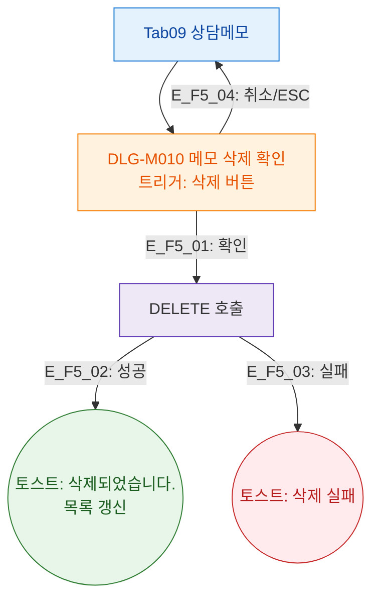

## 1. 목적

상담메모 탭에서 트리거되는 DLG-M010 삭제 확인 모달을 정의한다.

## 2. 전제조건

- Tab09 상담메모 활성

## 3. 다이어그램

## 4. 엣지 설명

| 엣지 ID | 단계 | 결과 |
|---------|------|------|
| E_F5_01 | 삭제 확인 | DELETE API |
| E_F5_02 | 성공 | 토스트 + 목록 갱신 |
| E_F5_03 | 실패 | 에러 토스트 |
| E_F5_04 | 취소/ESC | 모달 닫기 |

## 5. TC 후보

| TC ID | 타입 | Given | When | Then |
|-------|:----:|-------|------|------|
| TC-M004-09-F5-01 | positive P1 | 메모 있음 | 삭제 확인 | 메모 제거, success 토스트 |
