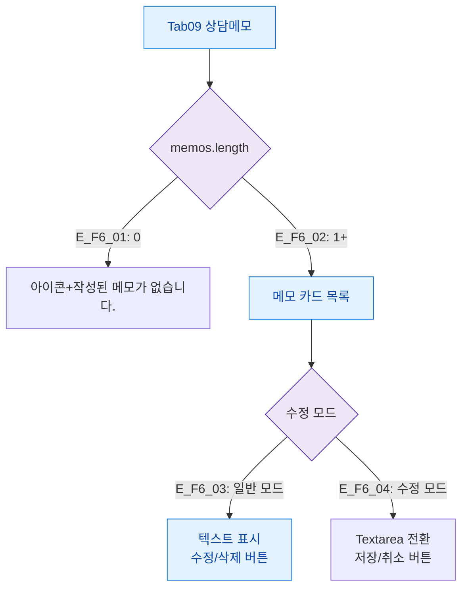

## 1. 목적

상담메모 탭의 데이터/수정모드 상태별 화면 분기를 정의한다.

## 2. 전제조건

- Tab09 상담메모 활성

## 3. 다이어그램

## 4. 엣지 설명

| 엣지 ID | 조건 | 화면 |
|---------|------|------|
| E_F6_01 | 메모 없음 | 빈 상태 메시지 |
| E_F6_02 | 메모 있음 | 카드 목록 |
| E_F6_03 | 일반 모드 | 텍스트 + 수정/삭제 버튼 |
| E_F6_04 | 수정 모드 | Textarea + 저장/취소 버튼 |

## 5. TC 후보

| TC ID | 타입 | Given | When | Then |
|-------|:----:|-------|------|------|
| TC-M004-09-F6-01 | positive P1 | 메모 없음 | 탭 진입 | "작성된 메모가 없습니다." |
| TC-M004-09-F6-02 | positive P1 | 메모 있음 | 수정 버튼 | Textarea + 저장/취소 버튼 전환 |
