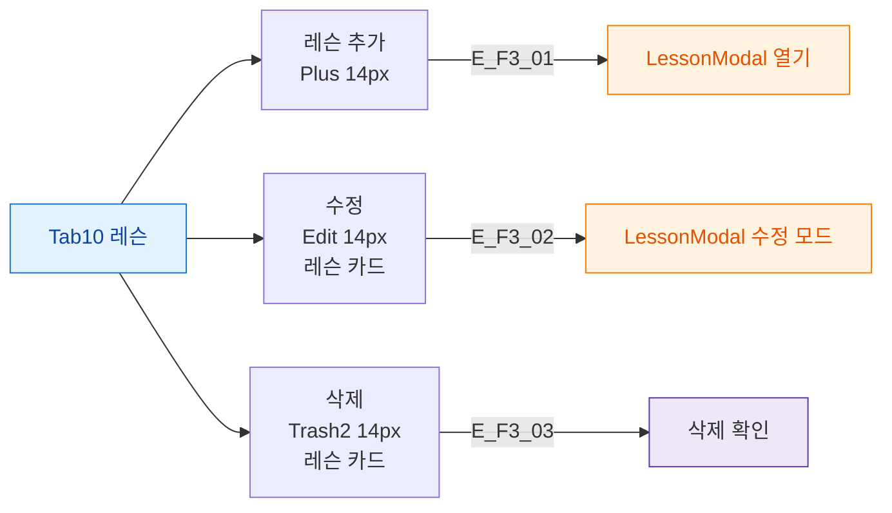

## 1. 목적

레슨 탭의 버튼 전체를 정의한다.

## 2. 전제조건

- Tab10 레슨 활성

## 3. 다이어그램

## 4. 엣지 설명

| 엣지 ID | 버튼 | 동작 |
|---------|------|------|
| E_F3_01 | 레슨 추가 | LessonModal 열기 |
| E_F3_02 | 수정 | LessonModal 수정 모드 |
| E_F3_03 | 삭제 | 삭제 확인 |

## 5. TC 후보

| TC ID | 타입 | Given | When | Then |
|-------|:----:|-------|------|------|
| TC-M004-10-F3-01 | positive P1 | 레슨 있음 | 수정 버튼 클릭 | LessonModal 기존 데이터 프리필 |
