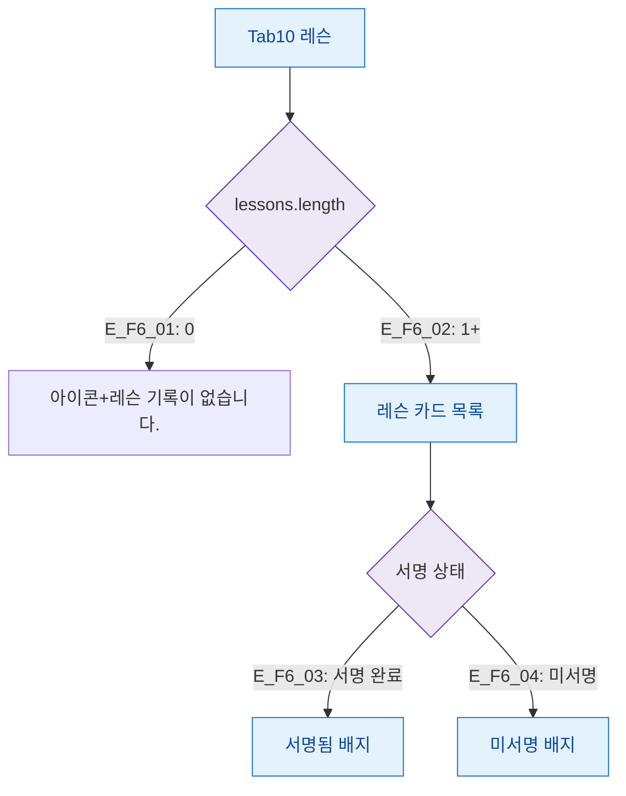

## 1. 목적

레슨 탭의 데이터 유무 및 서명 상태별 화면 분기를 정의한다.

## 2. 전제조건

- Tab10 레슨 활성

## 3. 다이어그램

## 4. 엣지 설명

| 엣지 ID | 조건 | 화면 |
|---------|------|------|
| E_F6_01 | 레슨 없음 | 빈 상태 메시지 |
| E_F6_02 | 레슨 있음 | 카드 목록 |
| E_F6_03 | 서명 완료 | 서명됨 배지 |
| E_F6_04 | 미서명 | 미서명 배지 |

## 5. TC 후보

| TC ID | 타입 | Given | When | Then |
|-------|:----:|-------|------|------|
| TC-M004-10-F6-01 | positive P1 | 레슨 없음 | 탭 진입 | "레슨 기록이 없습니다." |
| TC-M004-10-F6-02 | positive P1 | 레슨 있음 | 탭 진입 | StatCard 3종 + 카드 목록 표시 |
