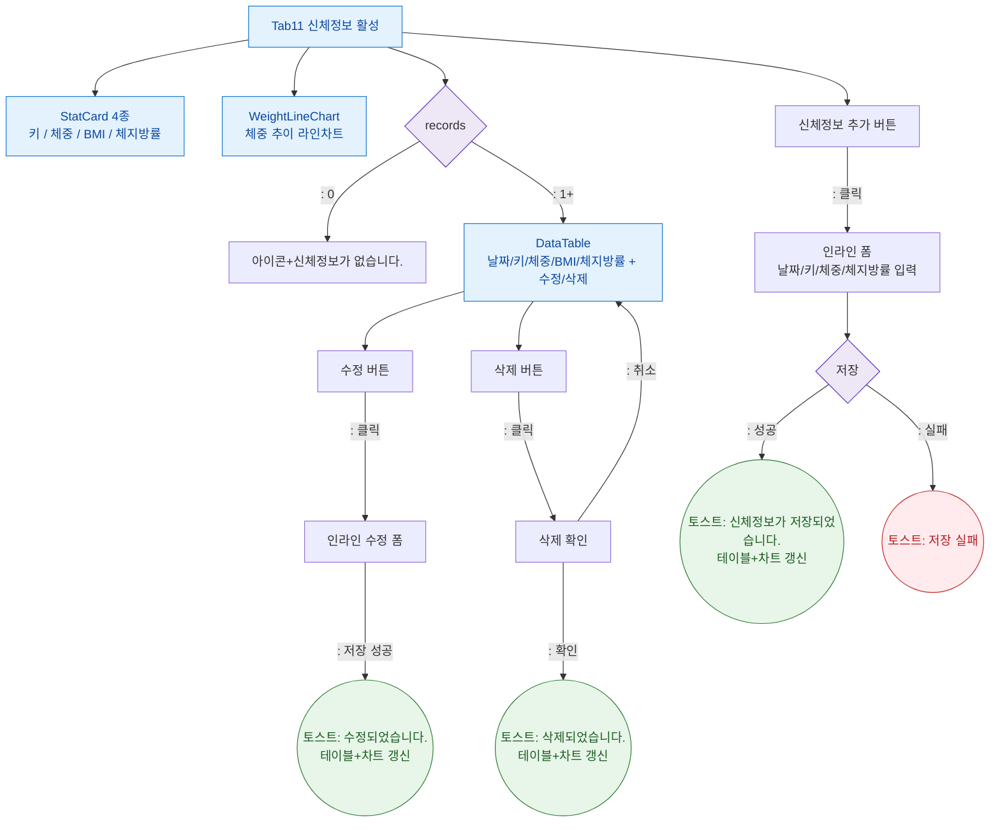

## 1. 목적

신체정보 탭(SCR-M004-11)의 신체 데이터 조회 + 추가 + 수정/삭제 플로우를 정의한다.

## 2. 전제조건

- tab=body 활성
- 신체정보 데이터 로드 완료

## 3. 다이어그램

## 4. 엣지 설명

| 조건/액션 | 결과 | |---------|-----------|------| | | 기록 없음 | 빈 상태 | | | 기록 있음 | DataTable | | | 추가 버튼 | 인라인 폼 | | | 저장 성공 | 토스트 + 갱신 | | | 저장 실패 | 에러 토스트 | | | 수정 버튼 | 인라인 수정 폼 | | | 수정 성공 | 토스트 + 갱신 | | | 삭제 버튼 | 삭제 확인 | | | 삭제 확인 | 토스트 + 갱신 | | | 삭제 취소 | 닫기 |
