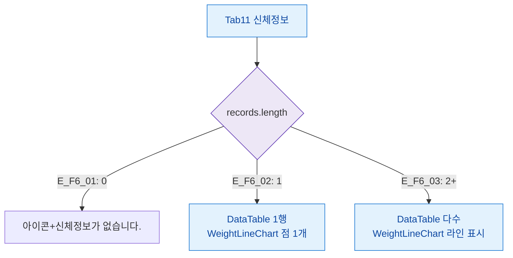

## 1. 목적

신체정보 탭의 데이터 유무 및 차트 표시 상태별 화면 분기를 정의한다.

## 2. 전제조건

- Tab11 신체정보 활성

## 3. 다이어그램

## 4. 엣지 설명

| 엣지 ID | 조건 | 화면 |
|---------|------|------|
| E_F6_01 | 기록 없음 | 빈 상태 메시지 |
| E_F6_02 | 기록 1건 | 테이블 1행 + 차트 점 1개 |
| E_F6_03 | 기록 2건+ | 테이블 + 라인차트 |

## 5. TC 후보

| TC ID | 타입 | Given | When | Then |
|-------|:----:|-------|------|------|
| TC-M004-11-F6-01 | positive P1 | 기록 없음 | 탭 진입 | "신체정보가 없습니다." |
| TC-M004-11-F6-02 | positive P1 | 기록 2건+ | 탭 진입 | WeightLineChart 라인 표시 |
