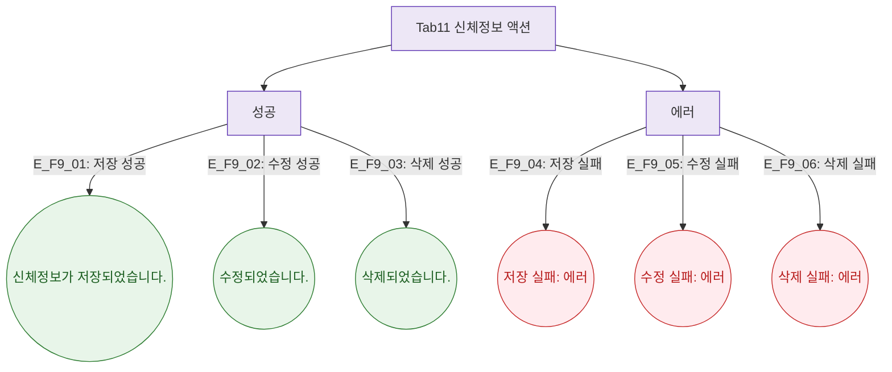

## 1. 목적

신체정보 탭에서 발생하는 토스트를 정의한다.

## 2. 전제조건

- Tab11 신체정보 활성

## 3. 다이어그램

## 4. 엣지 설명

| 엣지 ID | 상황 | 타입 | 메시지 |
|---------|------|------|--------|
| E_F9_01 | 저장 성공 | success | "신체정보가 저장되었습니다." |
| E_F9_02 | 수정 성공 | success | "수정되었습니다." |
| E_F9_03 | 삭제 성공 | success | "삭제되었습니다." |
| E_F9_04 | 저장 실패 | error | "저장 실패: ${error}" |
| E_F9_05 | 수정 실패 | error | "수정 실패: ${error}" |
| E_F9_06 | 삭제 실패 | error | "삭제 실패: ${error}" |

## 5. TC 후보

| TC ID | 타입 | Given | When | Then |
|-------|:----:|-------|------|------|
| TC-M004-11-F9-01 | positive P0 | 신체정보 입력 | 저장 클릭 | success 토스트 |
