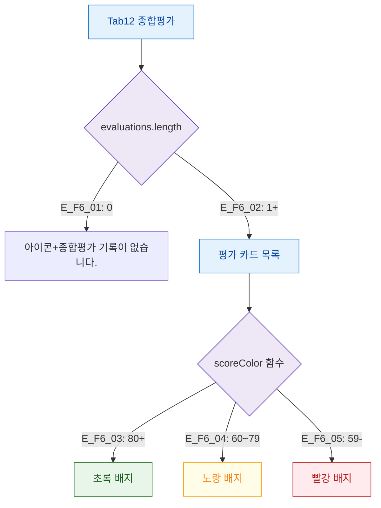

## 1. 목적

종합평가 탭의 데이터 유무 및 점수 색상 분기를 정의한다.

## 2. 전제조건

- Tab12 종합평가 활성

## 3. 다이어그램

## 4. 엣지 설명

| 엣지 ID | 조건 | 화면 |
|---------|------|------|
| E_F6_01 | 기록 없음 | 빈 상태 메시지 |
| E_F6_02 | 기록 있음 | 카드 목록 |
| E_F6_03 | 점수 80+ | 초록 배지 |
| E_F6_04 | 점수 60~79 | 노랑 배지 |
| E_F6_05 | 점수 59- | 빨강 배지 |

## 5. TC 후보

| TC ID | 타입 | Given | When | Then |
|-------|:----:|-------|------|------|
| TC-M004-12-F6-01 | positive P1 | 기록 없음 | 탭 진입 | "종합평가 기록이 없습니다." |
| TC-M004-12-F6-02 | positive P1 | 점수 85 | 탭 진입 | 초록 배지 표시 |
