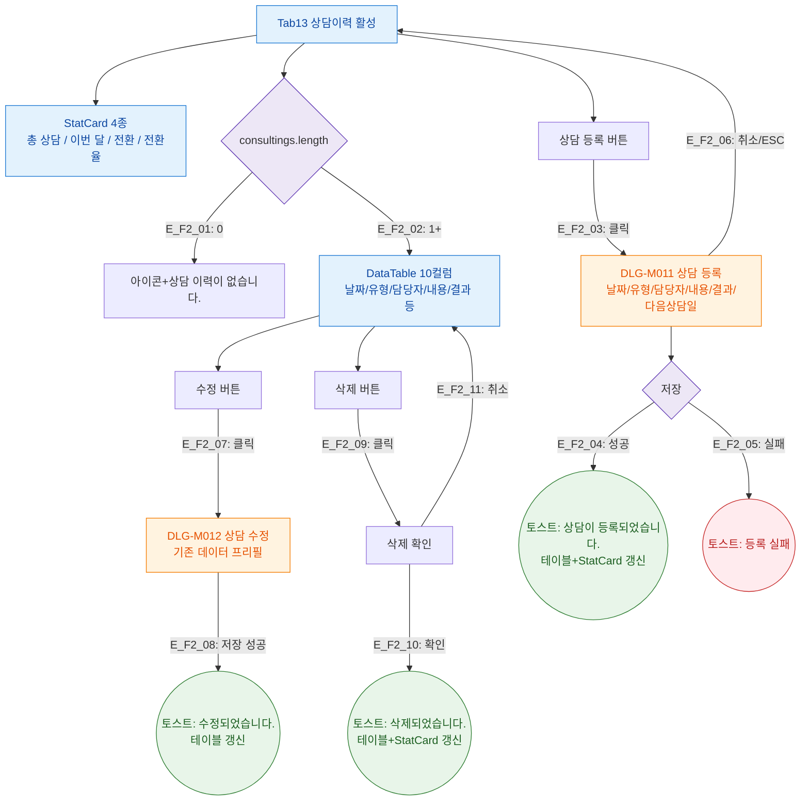

## 1. 목적

상담이력 탭(SCR-M004-13)의 상담 기록 조회 + 등록/수정/삭제 플로우를 정의한다.

## 2. 전제조건

- tab=consulting 활성
- 상담이력 데이터 로드 완료

## 3. 다이어그램

## 4. 엣지 설명

| 엣지 ID | 조건/액션 | 결과 |
|---------|-----------|------|
| E_F2_01 | 기록 없음 | 빈 상태 |
| E_F2_02 | 기록 있음 | DataTable |
| E_F2_03 | 상담 등록 버튼 | DLG-M011 열기 |
| E_F2_04 | 등록 성공 | 토스트 + 갱신 |
| E_F2_05 | 등록 실패 | 에러 토스트 |
| E_F2_06 | 취소/ESC | 모달 닫기 |
| E_F2_07 | 수정 버튼 | DLG-M012 열기 |
| E_F2_08 | 수정 성공 | 토스트 + 갱신 |
| E_F2_09 | 삭제 버튼 | 삭제 확인 |
| E_F2_10 | 삭제 확인 | 토스트 + 갱신 |
| E_F2_11 | 삭제 취소 | 닫기 |

## 5. TC 후보

| TC ID | 타입 | Given | When | Then |
|-------|:----:|-------|------|------|
| TC-M004-13-F2-01 | positive P0 | 상담이력 탭 | 상담 등록 후 저장 | 테이블 추가, 전환율 갱신, 토스트 |
| TC-M004-13-F2-02 | positive P1 | 기록 없음 | 탭 진입 | 빈 상태 메시지 |
| TC-M004-13-F2-03 | positive P1 | 기록 있음 | 탭 진입 | StatCard 4종 + DataTable 10컬럼 |
