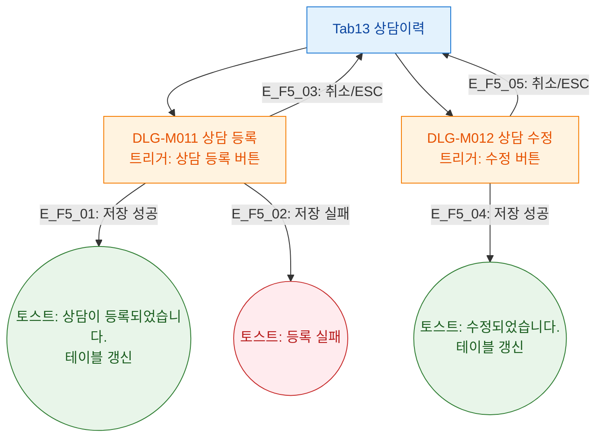

## 1. 목적

상담이력 탭에서 트리거되는 DLG-M011/M012를 정의한다.

## 2. 전제조건

- Tab13 상담이력 활성

## 3. 다이어그램

## 4. 엣지 설명

| 엣지 ID | 단계 | 결과 |
|---------|------|------|
| E_F5_01 | DLG-M011 저장 성공 | 토스트 + 갱신 |
| E_F5_02 | DLG-M011 저장 실패 | 에러 토스트 |
| E_F5_03 | DLG-M011 취소 | 모달 닫기 |
| E_F5_04 | DLG-M012 저장 성공 | 토스트 + 갱신 |
| E_F5_05 | DLG-M012 취소 | 모달 닫기 |

## 5. TC 후보

| TC ID | 타입 | Given | When | Then |
|-------|:----:|-------|------|------|
| TC-M004-13-F5-01 | positive P1 | DLG-M011 열림 | 저장 클릭 | 상담 추가, success 토스트 |
