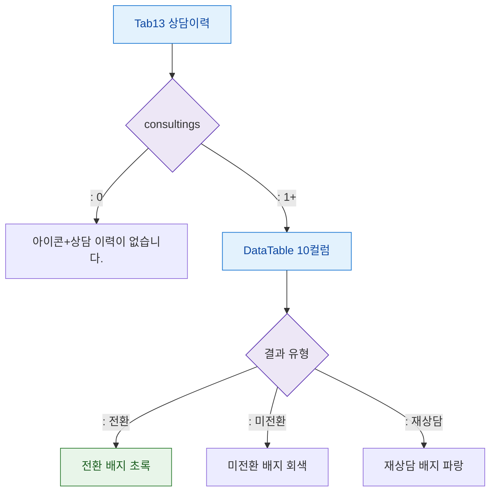

## 1. 목적

상담이력 탭의 데이터 유무 및 전환 결과 상태별 화면 분기를 정의한다.

## 2. 전제조건

- Tab13 상담이력 활성

## 3. 다이어그램

## 4. 엣지 설명

| 조건 | 화면 | |---------|------|------| | | 기록 없음 | 빈 상태 메시지 | | | 기록 있음 | DataTable 10컬럼 | | | 결과 전환 | 초록 배지 | | | 결과 미전환 | 회색 배지 | | | 결과 재상담 | 파랑 배지 |
