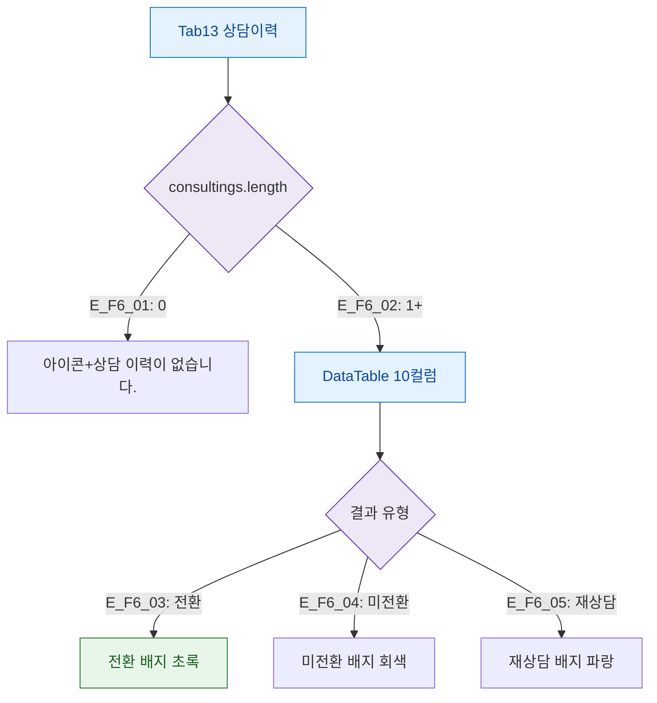

## 1. 목적

상담이력 탭의 데이터 유무 및 전환 결과 상태별 화면 분기를 정의한다.

## 2. 전제조건

- Tab13 상담이력 활성

## 3. 다이어그램

## 4. 엣지 설명

| 엣지 ID | 조건 | 화면 |
|---------|------|------|
| E_F6_01 | 기록 없음 | 빈 상태 메시지 |
| E_F6_02 | 기록 있음 | DataTable 10컬럼 |
| E_F6_03 | 결과 전환 | 초록 배지 |
| E_F6_04 | 결과 미전환 | 회색 배지 |
| E_F6_05 | 결과 재상담 | 파랑 배지 |

## 5. TC 후보

| TC ID | 타입 | Given | When | Then |
|-------|:----:|-------|------|------|
| TC-M004-13-F6-01 | positive P1 | 기록 없음 | 탭 진입 | "상담 이력이 없습니다." |
| TC-M004-13-F6-02 | positive P1 | 기록 있음 | 탭 진입 | StatCard 전환율 계산 표시 |
