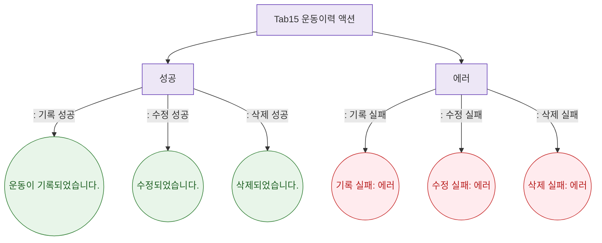

## 1. 목적

운동이력 탭에서 발생하는 토스트를 정의한다.

## 2. 전제조건

- Tab15 운동이력 활성

## 3. 다이어그램

## 4. 엣지 설명

| 상황 | 타입 | 메시지 | |---------|------|------|--------| | | 기록 성공 | success | "운동이 기록되었습니다." | | | 수정 성공 | success | "수정되었습니다." | | | 삭제 성공 | success | "삭제되었습니다." | | | 기록 실패 | error | "기록 실패: ${error}" | | | 수정 실패 | error | "수정 실패: ${error}" | | | 삭제 실패 | error | "삭제 실패: ${error}" |
